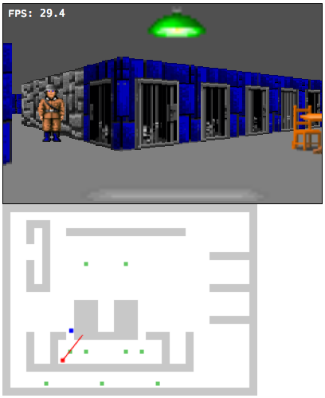

The Tale of Big Blue
====================

Part 1: Outlaw Editor
---------------------

*Hey!* Check out the video screencast of part 1: http://screencast.com/t/ZnRNXVLGi

I'm Martin Haye, and I'm gonnaa to tell you the story of a pixel called Big Blue, and his journey from Seth's mind to an Apple II screen. Along the way we'll be taking a detailed tour of the code and data behind the scenes so you can get a feel for how it all works.

[TODO: back-fill text and links]

Part 2: Casting Rays
--------------------

*Hey!* Check out the video screencast of part 2: http://screencast.com/t/NNLVxjHZH5

Last time we covered Big Blue's childhood, springing from Seth's mind into Outlaw Editor and then being converted to bits in a file. Now we'll take a detour to introduce ray casting, a critical influence in Blue's life.

You see, before Big Blue can make his debut on the Apple II screen, we need to know where on that screen he should appear. We know he's part of a window on a certain building in the town, but he should only show on the screen when the player is looking at that building. To figure that out I'm afraid we're going to need math but I promise I'll keep it light.

http://dev.opera.com/articles/view/creating-pseudo-3d-games-with-html-5-can-1/

We use a method called Ray Casting; it's seen in tons of first-person shooter games like Wolf 3D for the Apple IIgs. In fact we started with some Javascript code that simulates the look of Wolf 3D and even uses the same textures. 

 
http://devfiles.myopera.com/articles/650/step_4_enemies.htm

That code was a good starting point because it's easy and fun to play with because you can see the results immediately in a browser. However, the math uses lots of sin and cosin and sqrt which are slow on an Apple II, so I found and substituted more efficient math from a different raycasting tutorial I found:

http://lodev.org/cgtutor/raycasting.html

The basic idea is that shoot a bunch of virtual "rays" from the player's eye in each direction they can see. We start with rays pointing to the left, then rays closer to the center, then rays pointing to the right; what a ray hits tells us how to draw a tall thin column of pixels: what to draw (based on what kind of wall the ray hit and where on that wall it struck), and how big -- based on the distance (close things are big, far things are small).

Let's take a brief look at the code to do this. This is written in Javascript, making it easy to test changes to it before porting them to the Apple II.

The player has a position, X and Y, and a direction, shown in the code marked [BigBlue2a](https://github.com/badvision/lawless-legends/search?q=BigBlue2a).

```javascript
// Player attributes [ref BigBlue2a]
var player = {
  x : 11.0,      // current x, y position
  y : 10.5,
  dir : 0,    // the direction that the player is turning, either -1 for left or 1 for right.
```

For efficiency we perform as much math as possible at startup and stick the results into tables, that's done here. Lots of trigonometric functions and square roots so it's good to do this once instead of each time we have to draw the screen. You don't have to understand the math, this is just so you can get a feel for where it is and what it looks like. [BigBlue2b](https://github.com/badvision/lawless-legends/search?q=BigBlue2b)

```javascript
// Set up data tables prior to rendering [ref BigBlue2b]
function initCast() 
{
  var i;
  
  console.log("Initializing cast data.");
  precastData = [];
```

When you press a key, like to move forward, this code gets called and decides that to do, like update the player's X/Y coordinate or direction. [BigBlue2c](https://github.com/badvision/lawless-legends/search?q=BigBlue2c)

```javascript
    switch (e.keyCode) { // which key was pressed? [ref BigBlue2c]

      case 38: // up, move player forward, ie. increase speed
        player.speed = 1;
```

Then this code cycles through each ray and draws it. [BigBlue2d](https://github.com/badvision/lawless-legends/search?q=BigBlue2d)

```javascript
// Cast all the rays from the player position and draw them [ref BigBlue2d]
function castRays(force) 
{
  // If we're already showing this location and angle, no need to re-do it.
  if (!force && 
      player.x == prevX && 
```

The complicated math is handled in a separate function. This code traces an individual ray from the player's eye until it hits something on the map. [BigBlue2e](https://github.com/badvision/lawless-legends/search?q=BigBlue2e)

```javascript
// Cast one ray from the player's position through the map until we hit a wall.
// [ref BigBlue2e]
// This version uses only integers, making it easier to port to the 6502.
function intCast(x)
{
  // Start with precalculated data for this ray direction
  var data = precastData[player.angleNum][x];
  
  // Calculate ray position and direction 
  var wRayPosX = sword(player.x * 256);
```

The results of all this math for a given horizontal coordinate are: (1) the wall type, the coordinate left-to-right on that wall's texture, and the height of the column to draw. [BigBlue2f](https://github.com/badvision/lawless-legends/search?q=BigBlue2f)

```javascript
  // Wrap it all in a nice package. [ref BigBlue2f]
  return { wallType: map[bMapY][bMapX], 
           textureX: bWallX / 256.0,
           height:   lineHeight };
```

Next time we'll see this code on the Apple II, and take a look at how the results get drawn on the hi-res graphics screen.

