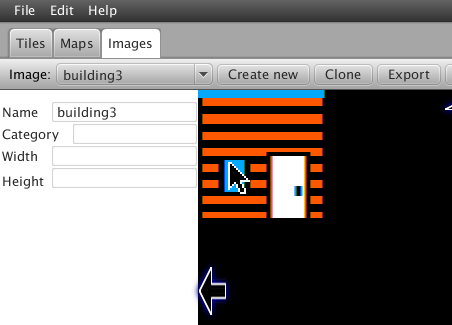
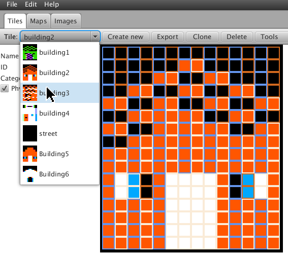
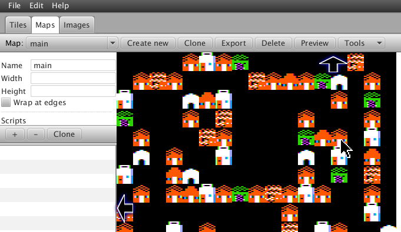
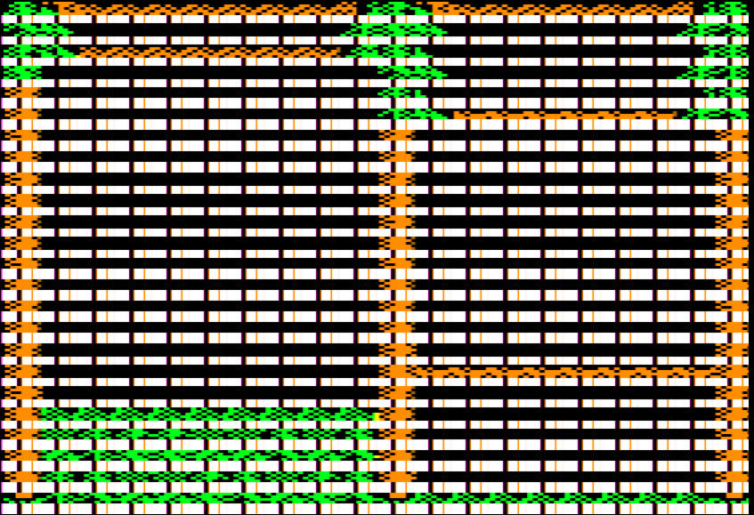
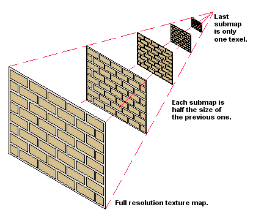

The Tale of Big Blue
====================

Part 1: Outlaw Editor
---------------------

*Hey!* Check out the video screencast of part 1: http://screencast.com/t/ZnRNXVLGi

I'm Martin Haye, and I'm gonna to tell you the story of a pixel called Big Blue, and his journey from Seth's mind to an Apple II screen. Along the way we'll be taking a tour of the tools, code and data behind the scenes so you can get a feel for how it all works.

Big Blue is the upper-left blue pixel in the corner of the building window, shown here in his image in the Outlaw Editor:  

Seth started out making a 14x16 tile to represent this building in 2D, and called it Building3: 

Then he put that tile onto a map, along with other tiles. These define where each building will be found in the town.  

Finally he created the image we saw earlier, by picking a color, picking a drawing mode, and clicking to create pixels in the Outlaw Editor. He named this image "Building3" to correspond with the tile on the map. The resulting image is termed a "texture" and it's going to be used to create the 3-D rendering of that building. When it's saved to disk, the result is an XML file. Here are some pieces of that file.

```XML
<?xml version="1.0" encoding="UTF-8" standalone="yes"?>
<gameData xmlns="outlaw">
    <image name="building1">
        <displayData platform="AppleII" width="40" height="192">D5AAD5AA80AAD5AAD580808000000000000000000000000000000000000000000000000000000000D5AAD58A00A8D5AAD580808000000000000000000000000000000000000000000000000000000000D5AA
        ...
    <image name="building3">
        <displayData platform="AppleII" width="40" height="192">D5AAD5AAD5AAD5AAD580800000000000000000000000000000000000000000000000000000000000D5AAD5AAD5AAD5AAD580800000000000000000000000000000000000000000000000000000000000D5AAD5AAD5AAD5AAD580800000000000000000000000000000000000000000000000000000000000D5AAD5AAD5AAD5AAD580800000000000000000000000000000000000000000000000000000000000A8D5AAD5AAD5AAD5AA80800000000000000000000000000000000000000000000000000000000000A8D5AAD5AAD5AAD5AA80800000000000000000000000000000000000000000000000000000000000A8D5AAD5AAD5
        ...
        AA80808000000000000000000000000000000000000000000000000000000000A885D5C2AAFCFF9FAA80808000000000000000000000000000000000000000000000000000000000A885D5C2AAFCFF9FAA808080000000000000000000000000000000000000000000000000000000008080D58280FCFF9F80808080000000000000000000000000000000000000000000000000000000008080D58280FCFF9F8080808000000000000000000000000000000000
        ...
    <tile id="TILE8bcf6" obstruction="true" name="building2">
        <displayData platform="AppleII" width="0" height="0">80808081A0848891A2C4A891A2C5A8D5AAD5AAD5E6E7E6E7EAD7EAD7EAD7EAD7</displayData>
    </tile>
    <tile id="TILE9a7b6" obstruction="true" name="building3">
        <displayData platform="AppleII" width="0" height="0">80808891A2C4E2DDBBF78AD1A2C4EEDDBBF782D5A2D4E2D5BBDDEED5A2D48AD5</displayData>
    </tile>
    <map name="main" width="512" height="512">
        <chunk x="0" y="0">
            <row>TILE76f18 TILE76f18 TILE76f18 TILE76f18 TILE8bcf6 TILE2aae5 TILE8bcf6 TILE34976 TILE76f18 TILE76f18 TILE76f18 TILE76f18 TILE76f18 TILE76f18 TILE9a7b6 TILE76f18 TILE76f18</row>
...
```

If you're familiar with the actual bytes that form high-res graphics on the Apple II you may recognize some of these values. I think Big Blue is actually two of the bits somewhere in "A885D5" but it's not terribly important. What is important is that the pixels are stored here in a format that can be easily read by other programs. How did those bits get in the file? Let's take a very brief look at the code.

Outlaw Editor is written in Java, and here's the Java code that actually twiddles the bits. [code link](https://github.com/badvision/lawless-legends/search?q=BigBlue1_10)

```Java
    public void set(boolean on, int x, int y) {
        byte[] data = getImageData();
        data[y * getWidth() + (x / 7)] |= (1 << (x % 7));
        if (!on) {
            data[y * getWidth() + (x / 7)] ^= (1 << (x % 7));
        }
        setData(data);
    }
```

It gets called by ``plot`` which figures out based on the X and Y coordinates where on the current pattern it should get the bits. [code link](https://github.com/badvision/lawless-legends/search?q=BigBlue1_20)

```Java
    public void plot(int x, int y, int[] pattern, boolean hiBitMatters) {
        if (x < 0 || y < 0 || x >= getWidth() * 7 || y >= getHeight()) {
            return;
        }
        int pat = pattern[(y % 16) * 4 + ((x / 7) % 4)];
        set((pat & (1 << (x % 7))) != 0, x, y);
```

That in turn got called by ``performAction`` that interprets the mouse click. [code link](https://github.com/badvision/lawless-legends/search?q=BigBlue1_30)

```Java
    public boolean performAction(boolean alt, boolean released, int x, int y) {
        ...
        switch (currentDrawMode) {
            ...
            case Pencil1px:
                if (canSkip) {
                    return false;
                }
                plot(x, y, currentFillPattern, hiBitMatters);
                redrawScanline(y);
    ...
```

We looked at the XML data which is great for portability but not very compact -- it's 96 kbytes! What we need to do is pack that data down into an efficient format for use on the Apple II. For that we have another Java program called PackMap. We run it from the command-line and here's how it goes. 

It reads in all the images, does some fancy manipulation of them, then writes them out to a little file (only 8 Kbytes now) and formed of tightly packed bytes.

```
0000000    4d  11  11  21  01  00  00  00  00  04  06  04  03  00  00  00
0000010    00  00  00  05  00  00  00  04  05  04  00  00  00  00  05  04
0000020    01  04  03  02  00  04  00  06  00  00  00  02  01  06  00  00
0000030    00  00  00  00  04  00  03  00  03  00  00  00  04  00  05  00
0000040    00  00  00  04  00  00  00  04  00  00  04  00  00  00  05  04
0000050    00  00  00  00  03  01  04  00  06  00  00  02  00  04  00  00
0000060    06  00  00  00  00  02  00  06  00  01  00  06  00  00  01  02
...
0000120    00  00  00  00  00  00  54  55  05  33  33  33  33  33  33  33
0000130    33  33  31  30  30  30  30  30  30  30  30  30  30  30  30  30
0000140    30  30  30  30  30  30  30  30  30  33  33  33  33  33  33  33
0000150    33  33  39  3c  3c  3c  3c  3c  3c  3c  3c  3c  3c  3c  3c  3c
0000160    3c  3c  3c  3c  3c  3c  3c  3c  3c  33  33  33  33  33  33  33
0000170    33  33  39  3c  3c  3c  3c  3c  3c  3c  3c  3c  3c  3c  3c  3c
0000180    3c  3c  3c  3c  3c  3c  3c  3c  3c  33  33  33  33  33  33  33
0000190    33  33  39  3c  3c  3c  3c  3c  3c  3c  3c  3c  3c  3c  33  33
...
```

The first part has a header, then the map tiles (just numbers now, not names), followed by all the texture data.

The code for PackMap is in a dialect of Java called Groovy. It's kind of like Java on steroids. It goes through each image and parses the bits and turns them back into a representation of pixels. [code link](https://github.com/badvision/lawless-legends/search?q=BigBlue1_40)

```Groovy
    def pixelize(dataEl)
    {
        ...
        return (0..<nLines).collect { lineNum ->
            ...
            for (def byteNum in 0..<nBytes) {
                def pos = (lineNum*nBytes + byteNum) * 2 // two hex chars per byte
                def val = Integer.parseInt(hexStr[pos..pos+1], 16)
                for (def bitNum in 0..6) {
                    if (pixBits == 0) // [ref BigBlue1_40]
                        pix = (val & 0x80) ? 4 : 0 // grab high bit of first byte of pix
                    ...
                }
            }
            return outRow
        }
    }
```

Then what it does is create several versions of each image, at progressively lower and lower resolutions. These are called "mipmaps", which basically stores a full-size version, then a half-size version, then quarter-size, eighth-size, etc. If you want to learn more about those and why we use them you can wait for part 4, or read the Wikipedia page now. http://en.wikipedia.org/wiki/Mipmap 

 

Then it writes out all that compact data we saw earlier using this code. It creates a header with the length and a type, then the raw data bytes. [code link](https://github.com/badvision/lawless-legends/search?q=BigBlue1_50)

```Groovy
    def writeMap(stream, rows, names) {
        ...
        // Header: one-char code followed by two-byte length 
        // (length should not include the 5-byte header)
        //
        def len = width*height
        stream.write((int)'M')  // for "Map"
        stream.write(width)
        stream.write(height)
        stream.write(len & 0xFF)
        stream.write((len>>8) & 0xFF)
        
        // After the header comes the raw data
        rows.each { row ->
            row.each { tile ->
                stream.write(names.findIndexOf { it == tile?.@name } + 1)
            }
        }
    }
```

That's it for part one. In the next part of the story we'll talk about how we figure out where to show Big Blue on the screen.


Part 2: Casting Rays
--------------------

*Hey!* Check out the video screencast of part 2: http://screencast.com/t/NNLVxjHZH5

Last time we covered Big Blue's childhood, springing from Seth's mind into Outlaw Editor and then being converted to bits in a file. Now we'll take a detour to introduce ray casting, a critical influence in Blue's life.

You see, before Big Blue can make his debut on the Apple II screen, we need to know where on that screen he should appear. We know he's part of a window on a certain building in the town, but he should only show on the screen when the player is looking at that building. To figure that out I'm afraid we're going to need math but I promise I'll keep it light.

http://dev.opera.com/articles/view/creating-pseudo-3d-games-with-html-5-can-1/

We use a method called Ray Casting; it's seen in tons of first-person shooter games like Wolf 3D for the Apple IIgs. In fact we started with some Javascript code that simulates the look of Wolf 3D and even uses the same textures. 

 
http://devfiles.myopera.com/articles/650/step_4_enemies.htm

That code was a good starting point because it's easy and fun to play with because you can see the results immediately in a browser. However, the math uses lots of sin and cosin and sqrt which are slow on an Apple II, so I found and substituted more efficient math from a different raycasting tutorial I found:

http://lodev.org/cgtutor/raycasting.html

The basic idea is that shoot a bunch of virtual "rays" from the player's eye in each direction they can see. We start with rays pointing to the left, then rays closer to the center, then rays pointing to the right; what a ray hits tells us how to draw a tall thin column of pixels: what to draw (based on what kind of wall the ray hit and where on that wall it struck), and how big -- based on the distance (close things are big, far things are small).

Let's take a brief look at the code to do this. This is written in Javascript, making it easy to test changes to it before porting them to the Apple II.

The player has a position, X and Y, and a direction, shown in the code marked [code link](https://github.com/badvision/lawless-legends/search?q=BigBlue2a).

```javascript
// Player attributes
var player = {
  x : 11.0,      // current x, y position
  y : 10.5,
  dir : 0,    // the direction that the player is turning, either -1 for left or 1 for right.
```

For efficiency we perform as much math as possible at startup and stick the results into tables, that's done here. Lots of trigonometric functions and square roots so it's good to do this once instead of each time we have to draw the screen. You don't have to understand the math, this is just so you can get a feel for where it is and what it looks like. code link](https://github.com/badvision/lawless-legends/search?q=BigBlue2b)

```javascript
// Set up data tables prior to rendering
function initCast() 
{
  var i;
  
  console.log("Initializing cast data.");
  precastData = [];
```

When you press a key, like to move forward, this code gets called and decides that to do, like update the player's X/Y coordinate or direction. [code link](https://github.com/badvision/lawless-legends/search?q=BigBlue2c)

```javascript
    switch (e.keyCode) { // which key was pressed?

      case 38: // up, move player forward, ie. increase speed
        player.speed = 1;
```

Then this code cycles through each ray and draws it. [code link](https://github.com/badvision/lawless-legends/search?q=BigBlue2d)

```javascript
// Cast all the rays from the player position and draw them
function castRays(force) 
{
  // If we're already showing this location and angle, no need to re-do it.
  if (!force && 
      player.x == prevX && 
```

The complicated math is handled in a separate function. This code traces an individual ray from the player's eye until it hits something on the map. [code link](https://github.com/badvision/lawless-legends/search?q=BigBlue2e)

```javascript
// Cast one ray from the player's position through the map until we hit a wall.
// This version uses only integers, making it easier to port to the 6502.
function intCast(x)
{
  // Start with precalculated data for this ray direction
  var data = precastData[player.angleNum][x];
  
  // Calculate ray position and direction 
  var wRayPosX = sword(player.x * 256);
```

The results of all this math for a given horizontal coordinate are: (1) the wall type, the coordinate left-to-right on that wall's texture, and the height of the column to draw. [code link](https://github.com/badvision/lawless-legends/search?q=BigBlue2f)

```javascript
  // Wrap it all in a nice package.
  return { wallType: map[bMapY][bMapX], 
           textureX: bWallX / 256.0,
           height:   lineHeight };
```

Next time we'll see this code on the Apple II, and take a look at how the results get drawn on the hi-res graphics screen.


Part 3: ...and calc! and blend! and calc!
-----------------------------------------

*Hey!* Check out the video screencast of part 3: TK

Let's do some pixel calisthenics! In part 3 we're going to see how all that ray-casting logic works on the Apple II, and then delve into the mysteries of blending color pixels onto the hi-res screen. The final part next time will cover the secret sauce, fast scaling of Big Blue's texture image to the proper size.

So I showed you a bunch of ray casting code in Javascript. Let's take a quick look at the 6502 assembly language code that does the same stuff. You don't have to understand it all, but it's good to know where it is and roughly what it does.

First, we set up the player's position and direction. We store each coordinate in two bytes: the low byte is the fractional part (0..255, so $80 = 128 = 0.5), and the high byte is the whole part (1, 2, etc.).
[code link](https://github.com/badvision/lawless-legends/search?q=BigBlue3_10)

```Assembly
; Establish the initial player position and direction
setPlayerPos:
    ; X=1.5
    lda #1
    sta playerX+1
    lda #$80
    sta playerX
    ; Y=2.5
    lda #2
    sta playerY+1
    lda #$80
    sta playerY
    ; direction=0
    lda #0
    sta playerDir
    rts
```

Remember those logarithm tables we created in the Javascript code? And the table of vectors for each possible angle? They're just encoded directly here rather than computed on the 6502. [code link](https://github.com/badvision/lawless-legends/search?q=BigBlue3_20)

```Assembly
; Table to translate an unsigned byte to 3+5 bit fixed point log2
tbl_log2_b_b:
    .byte $00,$00,$00,$00,$00,$07,$0C,$11,$15,$19,$1C,$1F,$22,$24,$27,$29
    .byte $2B,$2D,$2E,$30,$32,$33,$34,$36,$37,$38,$3A,$3B,$3C,$3D,$3E,$3F
    .byte $40,$41,$42,$43,$44,$44,$45,$46,$47,$48,$48,$49,$4A,$4A,$4B,$4C
    ;...etc...
```

[code link](https://github.com/badvision/lawless-legends/search?q=BigBlue3_30)

```Assembly
; Precalculated ray initialization parameters. One table for each of the 16 angles.
; Each angle has 63 rays, and each ray is provided with 4 parameters (one byte each param):
; dirX, dirY, deltaX, deltaY.
precast_0:
    .byte $72,$C7,$3E,$7C
    .byte $72,$C9,$3D,$7E
    .byte $72,$CB,$2C,$5E
    .byte $72,$CD,$39,$7E
    ;...etc...
precast_1:
    .byte $7F,$F7,$09,$7F
    .byte $7E,$F9,$05,$56
    .byte $7E,$FA,$05,$6F
    .byte $7D,$FC,$04,$7D
    ;...etc...
```

Here's the code to process a keypress from the player. [code link](https://github.com/badvision/lawless-legends/search?q=BigBlue3_40)

```Assembly
    ; Dispatch the keypress
:   cmp #'W'            ; 'W' for forward
    bne :+
    jsr moveForward
    jmp @nextFrame
:   cmp #'X'            ; 'X' alternative for 'S'
    bne :+
    lda #'S'
:   cmp #'S'            ; 'S' for backward
    bne :+
    jsr moveBackward
    jmp @nextFrame
:   cmp #'A'            ; 'A' for left
    bne :+
    ; ...etc...
```

When we need to re-draw, this code steps through each ray, calculating the texture number, coordinate, and height, then drawing it. 
[code link](https://github.com/badvision/lawless-legends/search?q=BigBlue3_50)

```Assembly
    ; Calculate the height, texture number, and texture column for one ray
@oneCol:
    stx pMap            ; set initial map pointer for the ray
    sty pMap+1
    phy                 ; save map row ptr
    phx
    pha                 ; save ray offset
    tay                 ; ray offset where it needs to be
    jsr castRay         ; cast the ray across the map
    lda pixNum
    bne :+
    jsr clearBlit       ; clear blit on the first pixel
:   jsr drawRay         ; and draw the ray
```

And finally there's a whole bunch of code that does all that complicated math we don't understand. I'm not going to explain all the code in depth, other than to say it does the same thing the Javascript code did... just using a lot more lines!
[code link](https://github.com/badvision/lawless-legends/search?q=BigBlue3_60)

```Assembly
;-------------------------------------------------------------------------------
; Cast a ray
; Input: pRayData, plus Y reg: precalculated ray data (4 bytes)
;        playerX, playerY (integral and fractional bytes of course)
;        pMap: pointer to current row on the map (mapBase + playerY{>}*height)
; Output: lineCt - height to draw in double-lines
;         txColumn - column in the texture to draw
castRay:
    ; First, grab the precalculated ray data from the table.
    ldx #1              ; default X step: forward one column of the map
    lda (pRayData),y    ; rayDirX
    ; ...and lots more code after this...
```

Okay, we're done covering ground we've seen before. Let's move on to a weighty subject: getting pixels on the screen. The Apple II's hi-res graphics memory is organized very strangely. The easy part is that each line is 40 consecutive bytes. However, the address for line 2 is not right after the address for line 1, and in general a weird formula is required to determine the starting address of a line.

| Line number | Start Address | End Address |
| ----------- | ------------- | ----------- |
| 0           | $2000         | $2027       |
| 1           | $2400         | $2427       |
| 2           | $2800         | $2827       |
| 3           | $2C00         | $2C27       |
| ...         | ...           | ...         |
| 8           | $2080         | $20A7       |
| 3           | $2180         | $21A7       |

It gets even weirder. Each byte stores 7 black-and-white pixels. What about color? In color mode each *pair* of pixels is taken in turn to mean a single color pixel. That means each byte stores *three and a half* pixels! Sounds crazy, yes? Sounds like it would lead to a very complicated program, and make it very time-consuming to put one pixel onto the screen.

You may have watched an image being loaded onto the Apple II hi-res screen. You'll have noticed that it loads in bands -- that's due to the weirdness we're talking about.

 

We don't want weird and complex, we need simple and fast. So our we throw some smarts at the problem to isolate all the complexity to a small part of our program, so the rest of the program doesn't have to worry about it. We use a technique called "unrolling". That's a little program that writes a big repetetive program into memory. In our case the unrolled routine has a block of code for every line on the screen, and each block contains an instruction or two for each kind of bit pair on that line. Code outside simply sticks the pixels in very regular and easy-to-calculate places, then calls the unrolled loop to blast everything onto the screen at high speed. In programming circles we call that blasting process a "bit blit" (stands for Bit-Level Block Transfer).

Here's the template for one block of the blit. This template gets copied and repeated for each line on the screen, substituting different addresses for the screen lines. [code link](https://github.com/badvision/lawless-legends/search?q=BigBlue3_70)

```Assembly
; Template for blitting code
blitTemplate: ; comments show byte offset
    lda decodeTo57 ;  0: pixel 3
    asl ;  3: save half of pix 3 in carry
    ora decodeTo01 ;  4: pixel 0
    ora decodeTo23 ;  7: pixel 1
    ora decodeTo45 ; 10: pixel 2
    sta (0),y ; 13: even column
    iny ; 15: prep for odd
    lda decodeTo01b ; 16: pixel 4
    ora decodeTo23b ; 19: pixel 5
    rol ; 22: recover half of pix 3
    ora decodeTo56 ; 23: pixel 6 - after rol to ensure right hi bit
    sta (0),y ; 26: odd column
    dey ; 28: prep for even
    ; 29 bytes total
```

All those ``lda`` and ``ora`` instructions are actually performing table lookups. The tables are aligned so that the low byte of the address is the actual value to look up. Here are the table addresses in memory, and the address of the unrolled code. [code link](https://github.com/badvision/lawless-legends/search?q=BigBlue3_75)

```Assembly
; Main-mem tables and buffers
decodeTo01   = $A700
decodeTo01b  = $A800
decodeTo23   = $A900
decodeTo23b  = $AA00
decodeTo45   = $AB00
decodeTo56   = $AC00
decodeTo57   = $AD00
...
blitRoll     = $B000    ; Unrolled blitting code. Size 29*128 = $E80, plus 1 for rts
```

The first code block will go at $B000. The code takes 7 color pixels from separate bytes and, using these fancy table lookups to quickly shift the bits into their proper place, combines them with binary math into 2 output bytes. 

The second code block will be a copy of the first, but instead of ``sta (0),y`` we'll use ``sta (2),y``. And so on for the third block. Then just before calling the blit for the first time, we have code that puts all the screen line addresses into locations 0, 2, 4, etc. so the blitting code will store to the right places on the screen. This level of indirection is used for switching which of the two hi-res screen buffers we write to (so we can draw on the one that's not being displayed, then flip to it instantly... it gives a very crisp feeling to the animation.)

Here's what it the actual unrolled code looks like when we disassemble it on an Apple II after doing some rendering:

```Assembly
B000-   AD 11 AD    LDA   $AD11
B003-   0A          ASL
B004-   0D 11 A7    ORA   $A711
B007-   0D 11 A9    ORA   $A922
B00A-   0D 11 AB    ORA   $AB22
B00D-   91 00       STA   ($00),Y
B00F-   C8          INY
B010-   AD 11 A8    LDA   $A811
B013-   0D 11 AA    ORA   $AA22
B016-   2A          ROL
B017-   0D 11 AC    ORA   $AC11
B01A-   91 00       STA   ($00),Y
B01C-   88          DEY
B01D-   AD 11 AD    LDA   $AD11
B020-   0A          ASL
B021-   0D 11 A7    ORA   $A711
B024-   0D 11 A9    ORA   $A922
B027-   0D 11 AB    ORA   $AB22
B02A-   91 02       STA   ($02),Y
B02C-   C8          INY
B02D-   AD 11 A8    LDA   $A811
B030-   0D 11 AA    ORA   $AA01
B033-   2A          ROL
B034-   0D 11 AC    ORA   $AC11
B037-   91 02       STA   ($02),Y
B039-   88          DEY
B03A-   AD 11 AD    LDA   $AD30
B03D-   0A          ASL
B03E-   0D 11 A7    ORA   $A711
B041-   0D 11 A9    ORA   $A911
B044-   0D 11 AB    ORA   $AB12
B047-   91 04       STA   ($04),Y
B049-   C8          INY
B04A-   AD 11 A8    LDA   $A830
B04D-   0D 11 AA    ORA   $AA32
B050-   2A          ROL
B051-   0D 11 AC    ORA   $AC22
B054-   91 04       STA   ($04),Y
B056-   88          DEY
B057-   AD 11 AD    LDA   $AD11
...
```

See all those 11's, 22's and other numbers at the end of these lines? Believe it or not those are actual pixel values! Originally in the template they were 00. So some code somewhere has filled them in. What code? We'll fill in that last missing piece next time, when we talk about texture scaling in the final chapter of Big Blue's biography.


Part 4: Scaling to the Finish
-----------------------------

*Hey!* Check out the video screencast of part 4: TK

In this last part of the story of Big Blue, let's fill in the missing piece: scaling from fixed size texture images to variable sized columns on the screen.

Recall that our favorite pixel lives in an image, and that image is packed into a structure called a "mipmap". 


http://en.wikipedia.org/wiki/Mipmap

Big Blue's image was originally drawn at 64x64 pixels, but we also store half sizes, quarter sizes, so 32x32, 16x16, 8x8, 4x4, etc. This improves the quality of the output because complicated decisions about which pixels to keep and which to toss when going to a smaller size can be made at packing time instead of drawing time.

So let's say we've figured out, using ray casting, that Big Blue's column should be drawn as the first column on the screen, and it should be 48 pixels high. Those 48 pixels, as discussed last time, need to be written into the bit blitting unrolled code, but how to do so?

Our rendering engine adopts the strategy of always "scaling up", never down. This prevents annoying flickering as things move side-to-side, but you don't have to really understand why. 

Anyway we take the desired size, 48 pixels high, and pick the mip map level lower than that, 32x32 in this case, and scale it up. That means we'll be taking 32 pixels and scaling them up to make 48. Doing the math, that means each input pixel will produce 1.5 output pixels. Of course we can't really have fractional output pixels, so in practice half the input pixels will produce a single output pixel (resulting 16 pixels), and the other half will produce two output pixels (for 32 pixels), totaling 48 pixels.

The trouble is that doing that calculation takes time, and we need to slam those pixels as fast as possible. So again we turn to the strategy of unrolling our code, this time taking it a ways further. A dirty little secret of the rendering engine is that it uses about 13 kbytes of code just for scaling! There is a dedicated subroutine for each possible column height. Let's look at the code for the one we're interested in, 48 pixels high. This is from the file ``expand.s``:

```Assembly
; Produce 48 rows from 32 rows
expand_48:
    jsr selectMip1
    jsr e_t40orotoo
    jsr e_r45tooroto
    jsr e_50rotooro
    jsr e_t55orotoo
    jsr e_r60tooroto
    jsr e_65rotooro
    jsr e_t70orotoo
    jsr e_r75tooroto
    jsr e_80rotooro
    lda (pTex),y
    iny
    sta 85*BLIT_STRIDE + blitRoll,x
    sta 86*BLIT_STRIDE + blitRoll,x
    lsr
    sta 87*BLIT_STRIDE + blitRoll,x
    rts
```

The first thing it does is select mipmap level 1 (level 0 is 64x64, level 1 is 32x32). Then it calls a bunch of subroutines with funny names to do the work. Here's the first one:

```Assembly
e_t40orotoo:
    lda (pTex),y
    iny
    sta 40*BLIT_STRIDE + blitRoll,x
    sta 41*BLIT_STRIDE + blitRoll,x
    lsr
    sta 42*BLIT_STRIDE + blitRoll,x
    lda (pTex),y
    iny
    sta 43*BLIT_STRIDE + blitRoll,x
    sta 44*BLIT_STRIDE + blitRoll,x
    rts
```

To explain what this does: first we fetch a byte from the texture, and increment the pointer into the texture to prepare for a future fetch. ``lda (pTex),y``. Then we use ``sta`` to store that byte *twice* into the unrolled blit code, for lines 40 and 41 on the screen. Our input packs two pixels in each byte, and we get to the other one using ``lsr``. Then we fetch the next input pixel, and store it twice. See the pattern? 1 pixel -> 2 pixels, then 1 pixel -> 1 pixel. This will achieve 48 total output pixels from 32 input pixels.

You'll notice the pixels are found in memory in vertical column order. That's because this is precisely the order we need to find them when we're drawing columns of pixels.

The unrolled code for all heights is over 6,000 lines! Who wrote all that code? Not me. The scale-up code is produced *by a program* that does a better job than I ever could. Here's an excerpt. [Direct code link](https://github.com/badvision/lawless-legends/search?q=BigBlue4_10)

```Python
# Now generate the controlling code
for (srcHeight, dstHeight, mipLevel, texOff, segs) in allHeights:
  outFile.write("; Produce %d rows from %d rows\n" % (dstHeight, srcHeight))
  outFile.write("expand_%d:\n" % dstHeight)
  outFile.write("    jsr selectMip%d\n" % mipLevel)
  if (texOff != 0):
    outFile.write("    ldy #%d\n" % texOff)
  for i in range(len(segs)):
    seg = allSegs[segs[i]]
    if seg.refs == 1 and not(seg.generated):
      seg.genCode(False)
...
```

And that's the full story of how Big Blue got from Seth's mind to the screen. In short:
- Seth mouse-clicked to put him into an image
- That image got packed into mipmaps on the Apple II
- We used ray casting to determine where on the screen to put Big Blue's column, and how high to make it.
- Based on the height, a mipmap level was chosen and the pixels replicated to scale up to the proper height, writing the results into the bit blitting code
- And finally, the bit blitter blended Big Blue's column with pixels from other columns and blasted them onto the screen.


I hope you enjoyed this brief history of a little pixel that made it big. There have been an awful lot of concepts and code, so don't stress if it sink in. The goal is to give you an overview, a feeling, for what's involved, to pique your interest in some of the concepts involved, and to give you pointers into the code in case you want to explore further.

Thanks for reading!